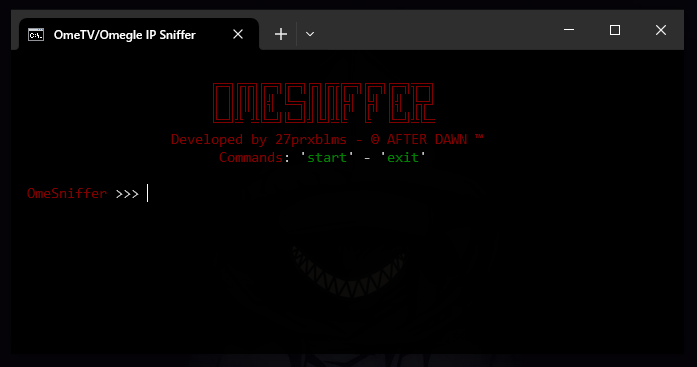

# OmeSniffer
OmeTV and Omegle IP Sniffer

## Não me responsabilizo pelo mal uso dessa ferramenta:
Utilize esse código para fins educacionais, para entender, aprender e desenvolver seus proprios projetos...

## Informações basicas da ferramenta:

- Nome: OmeSniffer.py
- Versão: BETA
- Equipe: After Dawn Team (https://afterdawnteam.com)
- Developer: 27prxblms
- Linguagem: Python

Essa ferramenta basicamente utiliza o Wireshark para capturar os pacotes de rede enquanto o usuário esta no OmeTV ou no Omegle e apartir disso pega o IP da pessoa com quem você esta conversando, logo em seguida utilizando o MaxMind's GeoLite2 ele identifica a Cidade, Estado e Pais da pessoa.

## Utilização:

É necessário ter instalado o Python, Wireshark e ter acesso aos bancos de dados do MaxMind GeoLite2, pois não vou disponibilizá-los aqui.

